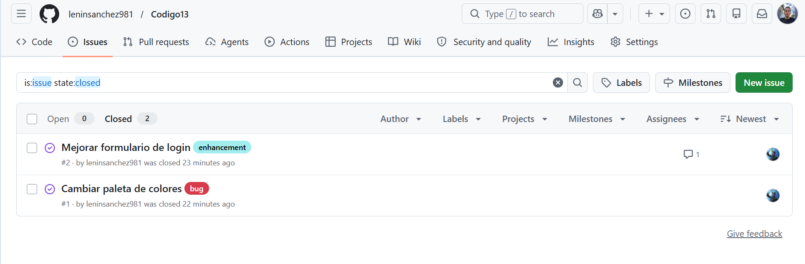
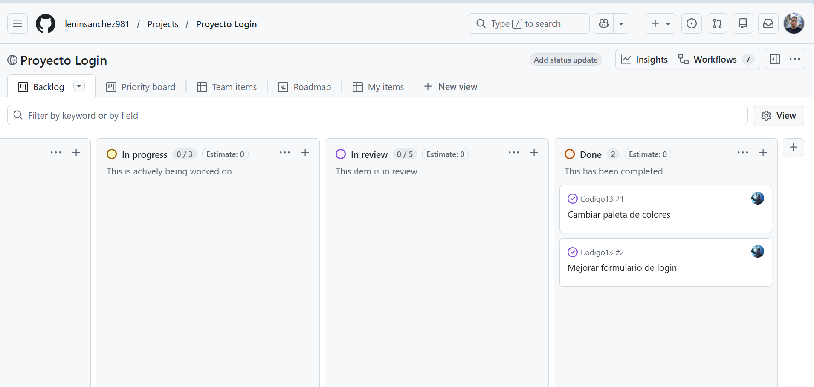

# Día 2 - Trabajo Colaborativo con GitHub

## Objetivo

Realizar trabajo colaborativo utilizando GitHub, gestionando tareas mediante Issues y un tablero Kanban (Projects).

## Actividades Realizadas

### 1. Creación de Issues

Se crearon dos issues para gestionar las tareas del proyecto:

* **Issue #1:** Cambiar el color de fondo.
* **Issue #2:** Hacer el botón más redondo.

### 2. Asignación de Colaboradores

Los issues fueron asignados a los integrantes del equipo para distribuir las tareas y facilitar el trabajo colaborativo.

### 3. Creación del Proyecto Kanban

Se creó un tablero Kanban utilizando GitHub Projects para organizar el flujo de trabajo.

Columnas utilizadas:

* Backlog
* Ready
* In Progress
* In Review
* Done

### 4. Modificación del Proyecto

Se realizaron cambios en el archivo `login.html`:

#### Cambio de color de fondo

Se modificó el fondo de la página utilizando nuevos colores en el gradiente.

#### Modificación del botón

Se aumentó el valor de `border-radius` para hacer el botón más redondo.

### 5. Control de Versiones

Los cambios fueron registrados mediante:

```bash
git add .
git commit -m "Fixes #1 y Fixes #2"
git push origin main
```

### 6. Resolución de Issues

Después de realizar los cambios correspondientes, los issues fueron marcados como completados y movidos a la columna **Done** del tablero Kanban.

---

## Capturas de Evidencia

### Captura de los Issues

> 

### Captura del Proyecto Kanban

>
