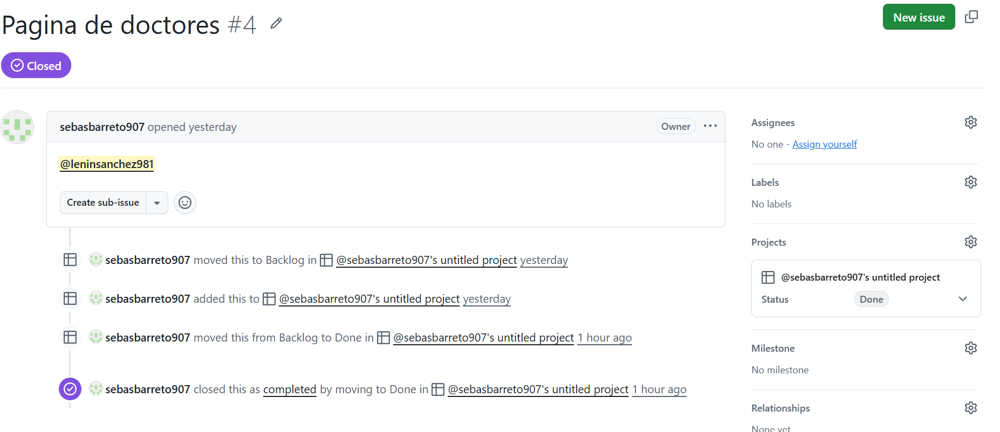

# Día 3 - Desarrollo del Sistema Hospitalario Trabajo Grupal

## Objetivo

Participar en el desarrollo colaborativo del Sistema Hospitalario utilizando GitHub y herramientas de control de versiones.

## Actividades Realizadas
### Trabajo Colaborativo

* Se revisó la estructura del proyecto.
* Se asignaron tareas específicas a cada integrante del equipo.
* Se trabajó utilizando GitHub para coordinar las actividades.
* Se aplicaron conceptos de Git Flow y manejo de ramas.
* Cada miembro desarrolló la funcionalidad que le fue asignada.
* Se integraron los cambios realizados al proyecto principal.

### Desarrollo de la Página de Doctores

* Se creó la sección de doctores.
* Se agregaron nombres de los especialistas.
* Se añadieron las especialidades médicas.
* Se incorporaron los horarios de atención.
* Se agregaron imágenes para cada doctor.
* Se organizó la información en tarjetas.
* Se verificó la visualización de los datos.

### Diseño y Estilos

* Se utilizó HTML para la estructura.
* Se aplicó CSS para el diseño.
* Se mejoró la presentación visual.
* Se ajustó la distribución de los elementos.
* Se realizaron pruebas de funcionamiento.

### Participación Personal

Mi tarea fue desarrollar la lista de doctores del Sistema Hospitalario.

Las actividades realizadas fueron:

* Crear la página de doctores.
* Agregar información de los médicos.
* Incluir especialidades y horarios.
* Incorporar imágenes de los doctores.
* Verificar enlaces y rutas de archivos.
* Realizar pruebas de visualización.

## Aprendizajes Obtenidos

* Uso de GitHub para trabajo colaborativo.
* Manejo de ramas en Git.
* Desarrollo de páginas web con HTML.
* Aplicación de estilos con CSS.
* Organización de contenido web.
* Trabajo en equipo dentro de un proyecto.

## Evidencia

> 

